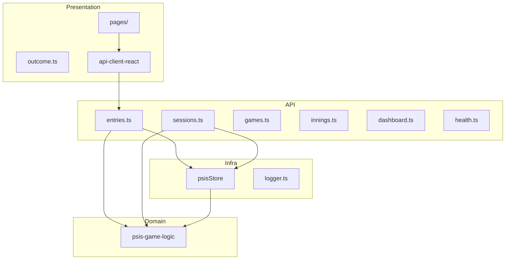

# Application Architecture

Layers, dependencies, boundaries, and cross-cutting concerns.

---

## Layered Model

```
┌─────────────────────────────────────┐
│  Presentation                        │  artifacts/psis (React)
├─────────────────────────────────────┤
│  API / Application Services          │  artifacts/api-server/routes
├─────────────────────────────────────┤
│  Domain                              │  lib/psis-game-logic
├─────────────────────────────────────┤
│  Infrastructure / Persistence        │  psisStore.ts → JSON
└─────────────────────────────────────┘
         ▲
         │ types from api-zod (generated from contract)
```

**Dependency rule:** Domain does not depend on Presentation or Infrastructure.

---

## Component Diagram



---

## Layer Responsibilities

| Layer | May | Must not |
|-------|-----|----------|
| **Presentation** | UX, wizard flow, display | Compute EABR math |
| **API routes** | HTTP, Zod validation, glue | Duplicate domain rules |
| **Domain** | Pure calculations | File I/O, HTTP |
| **Persistence** | Read/write JSON | Business rule decisions |

---

## Module Interactions

### Entry creation (critical path)

1. `track.tsx` → `useCreateEntry()` hook
2. `POST /api/entries` → `entries.ts`
3. Zod parse `CreateEntryInput`
4. `resolveInningForNewAtBat`, `computeEabrUnits`, `applyOutcomeToBaseState`, etc.
5. `appendEntry()` → `psis_entries.json`

### Session end

1. `track.tsx` → `useEndSession()`
2. `POST /api/sessions/end` → `sessions.ts`
3. `computeSessionSummary()` → `psis_sessions.json`
4. `startNewGame()` → `psis_game_state.json`

---

## Dependency Relationships

| From | To | Via |
|------|-----|-----|
| psis | api-client-react | workspace import |
| api-server | api-zod | workspace import |
| api-server | psis-game-logic | direct + via psisStore re-export |
| scripts | psis-game-logic | direct |
| api-zod | openapi | codegen |
| api-client-react | openapi | codegen |

**No circular dependencies** between domain and presentation.

---

## Error Boundaries

| Boundary | Behavior |
|----------|----------|
| Zod validation | 400 `{ message }` |
| Business rule rejection | 400 with explanation |
| Missing PORT at startup | Process exit |
| Missing frontend dist (prod) | Warn + API-only mode |
| Uncaught exception | 500, logged via pino |

No global error UI contract — frontend uses React Query error states.

---

## Logging Architecture

| Concern | Implementation |
|---------|----------------|
| Library | pino |
| HTTP | pino-http (method, path, status) |
| Production format | JSON stdout |
| Development | pino-pretty |
| Config | `LOG_LEVEL` env |
| Redaction | Authorization, cookies |

Container platforms aggregate stdout (future CloudWatch).

---

## Configuration Architecture

| Config | Source | Required |
|--------|--------|----------|
| `PORT` | Env | Yes |
| `NODE_ENV` | Env | Production static serve |
| `BASE_PATH` | Env | Build-time (Vite) |
| `LOG_LEVEL` | Env | No (default info) |

No config files at runtime — **12-factor env vars**.

---

## Production Static Serving

`app.ts` conditionally mounts:

1. `/api` → API router
2. Static files from `artifacts/psis/dist/public`
3. SPA fallback for non-API GET routes

Architectural decision: **single deployable unit** for PA.

---

## Extension Points

| Extension | Hook |
|-----------|------|
| New endpoint | OpenAPI + route module |
| New rule | psis-game-logic + scenario test |
| New persistence | Replace psisStore implementation |
| Auth middleware | `app.ts` before routes |
| Split services | Extract static to CDN — future |

---

## Related

- [Logical_Architecture.md](./Logical_Architecture.md)
- [Application layers (developer)](../developer/System_Design.md)
