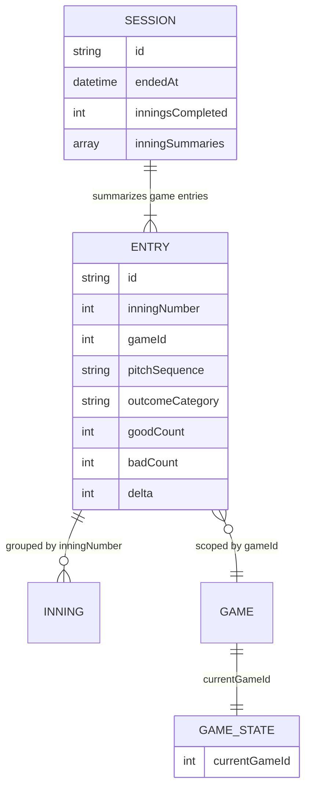
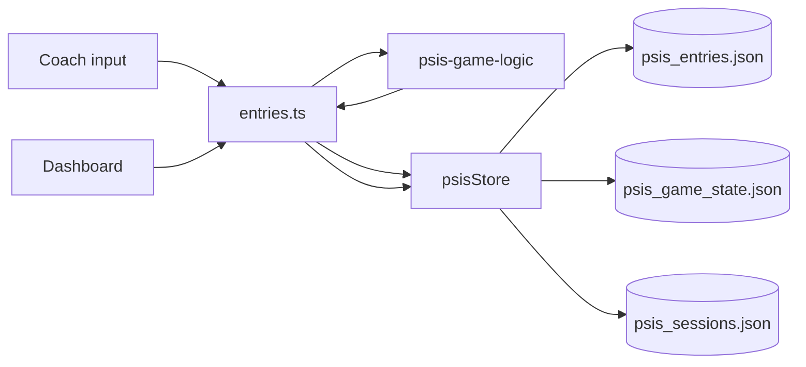
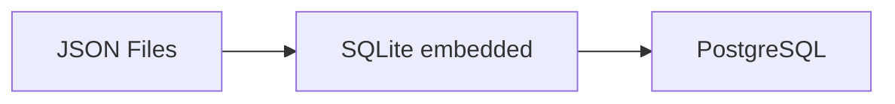

# Data Architecture

Persistence model, lifecycle, and migration path.

---

## Current Persistence Model

**JSON flat files** on local filesystem — no database server.

| File | Path | Content |
|------|------|---------|
| `psis_entries.json` | `artifacts/api-server/data/` | All plate-appearance entries (append) |
| `psis_game_state.json` | same | Current `gameId` |
| `psis_sessions.json` | same | Saved session summaries (append) |

Docker production path: `/app/artifacts/api-server/data/`

---

## Data Model (Conceptual)



---

## Entry Lifecycle

```
POST /api/entries
    → server computes all derived fields
    → append to psis_entries.json
    → immutable after creation (no PATCH)
```

Legacy entries may lack optional fields (`gameId`, `baseState`) — schema allows optional for backward compatibility.

---

## Game State Lifecycle

```
POST /api/games/new
    → increment currentGameId in psis_game_state.json
    → Tracker scopes live view to new game
    → historical entries preserved
```

---

## Session Lifecycle

```
POST /api/sessions/end (≥1 completed inning)
    → computeSessionSummary() over current game entries
    → append to psis_sessions.json
    → bump gameId (like New Game)
```

---

## Data Flow Diagram



---

## Read Patterns

| Operation | Pattern |
|-----------|---------|
| List entries | Load full file, filter/sort in memory |
| Dashboard aggregates | Compute on read |
| Current inning | Derive from entries + gameId |
| Sessions list | Load sessions file |

**Architectural assumption:** Single-team season data volume fits in memory.

---

## Write Patterns

| Operation | Pattern |
|-----------|---------|
| Append entry | Read entire file → append → write |
| Update game state | Read → modify one field → write |
| Append session | Read → append → write |

**No file locking** — single writer process assumed.

---

## Backup Strategy

| Layer | Responsibility |
|-------|----------------|
| **Architecture** | Data is files — must be backed up outside container |
| **Operator** | Volume mount + filesystem backup |
| **Future PE** | EFS snapshots, automated backup policy |

Container ephemerality without volume = **data loss on `docker rm`**.

---

## Data Lifecycle (Retention)

| Data | Retention (current) |
|------|---------------------|
| Entries | Indefinite (append-only) |
| Sessions | Indefinite |
| Test reports | Regenerated on each `test:psis` run |

No purge/TTL architecture — future consideration if storage grows.

---

## Future Database Migration



| Stage | Trigger |
|-------|---------|
| **Stay on JSON** | Current — single team, low concurrency |
| **SQLite** | Need queries, still single-node |
| **PostgreSQL** | Multi-user concurrent writes, reporting, PE scale |

**Migration principle:** Keep `psis-game-logic` pure — swap `psisStore.ts` implementation or add repository layer without changing rules.

Unused `lib/db` (Drizzle) scaffold may support PostgreSQL path.

---

## Data Integrity Rules

- Server computes scoring — client cannot set `goodCount`/`badCount`/`delta`
- Entries immutable after POST
- `gameId` scopes Tracker; Dashboard reads all sessions
- Legacy enum values retained in schema for old rows

---

## Related

- [Scalability_Roadmap.md](./Scalability_Roadmap.md)
- [Decision_Record.md](./Decision_Record.md) — ADR JSON persistence
