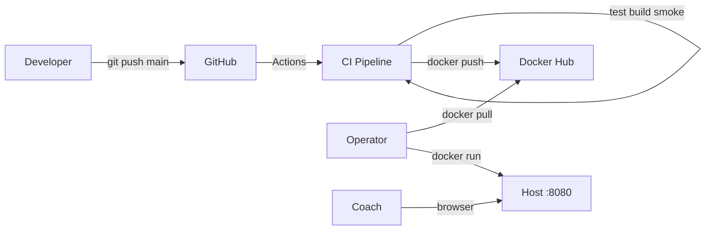
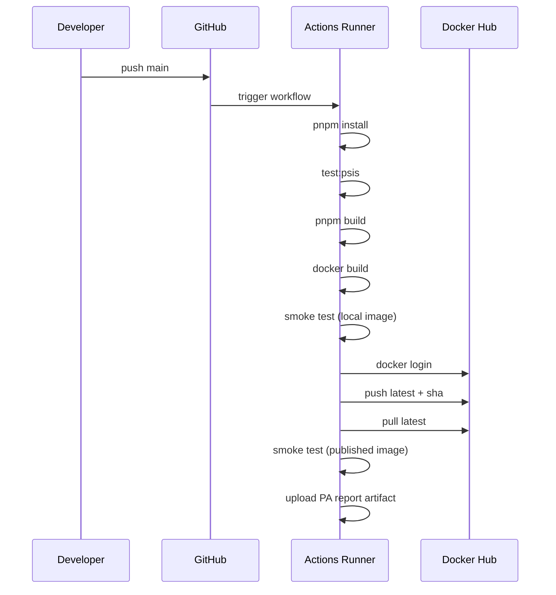
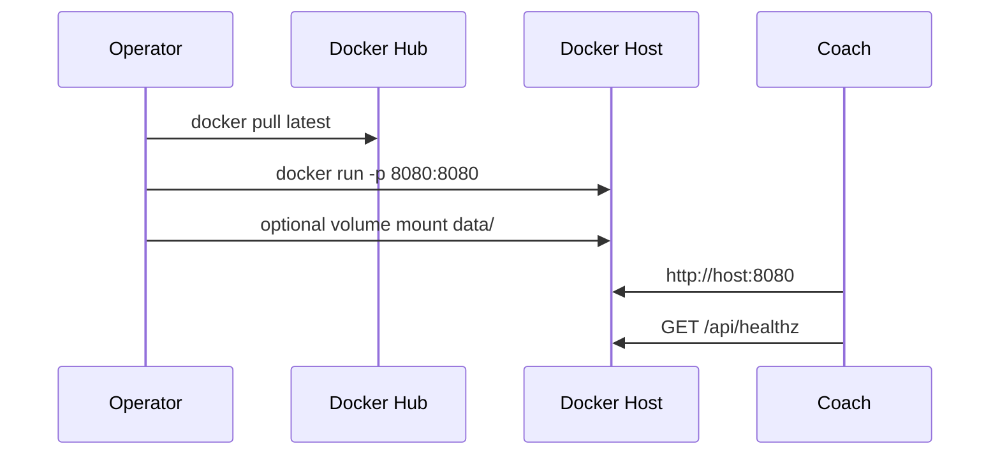
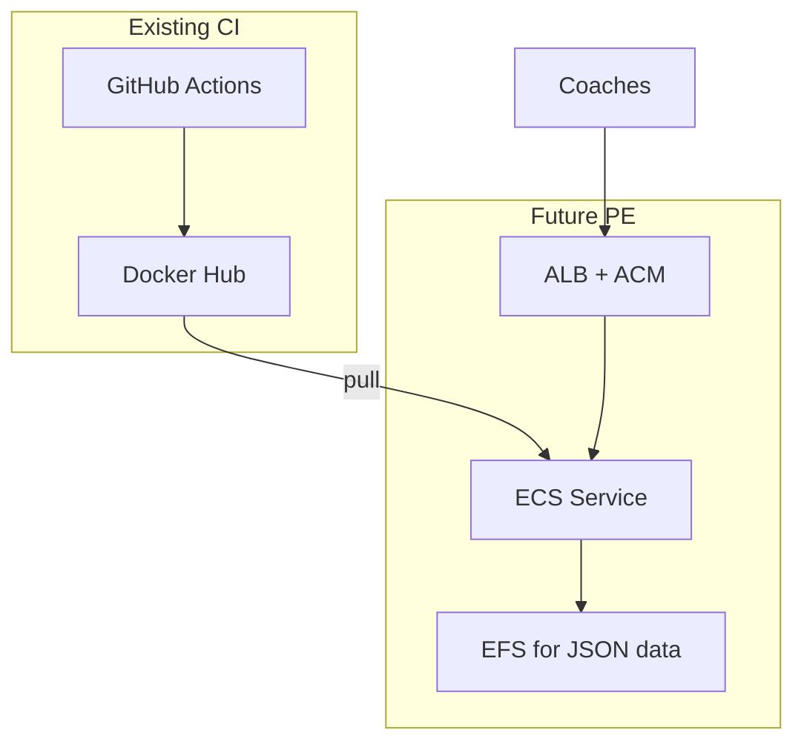

# Deployment Architecture

PA, PE, PAPE, PAPEV and deployment sequences.

---

## Nebula Deployment Phases

| Phase | Name | PSIS Status |
|-------|------|-------------|
| **PA** | Production Artifact | **PASS** — image on Docker Hub |
| **PE** | Production Environment | **Not started** — AWS/hosting |
| **PAPE** | PA + PE integrated | Future |
| **PAPEV** | End-to-end validated | Future |

---

## Current Deployment (PA)

---

## GitHub Actions Deployment Sequence

---

## Operator Deployment Sequence

See [operator docs](../operator/PSIS_Operator_Installation_Guide.md).

---

## Future AWS PE Deployment (Planned)

**PE ACI will define:** service definition, health checks, persistence, TLS, secrets — without changing PA image build semantics.

---

## PAPE / PAPEV Criteria (Architectural)

| Milestone | Criteria |
|-----------|----------|
| **PAPE** | Same Docker image runs in AWS PE; data persists; health checks pass |
| **PAPEV** | Coach workflow validated in PE; backup/restore tested; ops runbook complete |

---

## Deployment Invariants

1. `main` merge triggers publication — no manual image tag on laptop
2. Scenario tests gate Docker build (inside Dockerfile too)
3. Published image smoke-tested after Hub push
4. `PORT=8080` and `NODE_ENV=production` at runtime
5. Health check: `GET /api/healthz`

---

## Rollback Strategy (Current)

| Method | Action |
|--------|--------|
| Image tag | Pull `taig2k/...:<previous-sha>` |
| `latest` | Points to last successful `main` — verify digest before rollback |
| Data | Volume backup independent of image version |

No blue/green until PE phase.

---

## Environment Matrix

| Environment | Image source | Data | TLS |
|-------------|--------------|------|-----|
| CI smoke | Local build / Hub | Ephemeral | No |
| Operator laptop | Hub `latest` | Optional volume | No |
| Future AWS PE | Hub tag | EFS/EBS | ALB |

---

## Related

- [CI/CD Pipeline (developer)](../developer/CI_CD_Pipeline.md)
- [Physical_Architecture.md](./Physical_Architecture.md)
