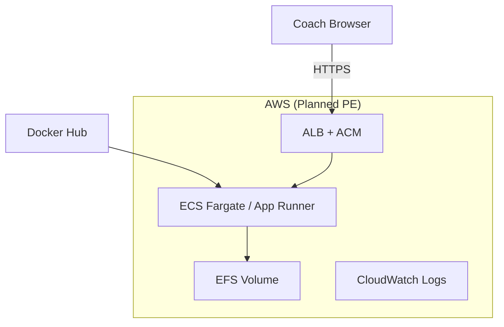
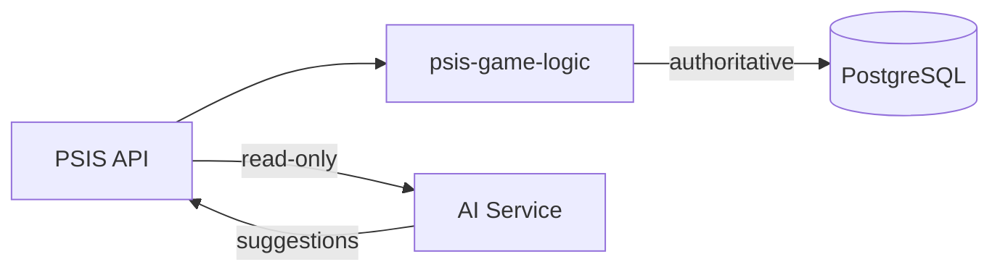

# Future Architecture

Long-term vision for PSIS within the Nebula platform.

---

## Vision Statement

PSIS evolves from a **single-team coaching tool** into a **Nebula-aligned pitching intelligence platform** — preserving EABR domain integrity while adding enterprise deployment, analytics, and optional AI assistance.

**Invariant across all futures:** `psis-game-logic` remains the authoritative scoring engine.

---

## Strategic Horizons

| Horizon | Timeframe (indicative) | Focus |
|---------|------------------------|-------|
| **H1** | Now → PE ACI | AWS hosting, TLS, durable storage |
| **H2** | Post-PE | Auth, PostgreSQL, multi-coach |
| **H3** | Platform | Analytics, AI assist, Nebula integration |
| **H4** | Enterprise | Multi-tenant, org-wide deployment |

---

## H1: Production Environment (Next)

**Goals:**

- Same Docker image as PA — no forked build
- Persistent data via EFS mount at `/app/artifacts/api-server/data`
- Automated deploy on image tag (future workflow extension)
- Health checks via `GET /api/healthz`

See [Deployment_Architecture.md](./Deployment_Architecture.md).

---

## H2: Identity and Data Platform

| Capability | Direction |
|------------|-----------|
| **Authentication** | OAuth2/OIDC or JWT middleware |
| **Authorization** | Role-based: coach, admin, read-only |
| **Persistence** | PostgreSQL + Drizzle ORM |
| **Migration** | Dual-write JSON + DB during transition |

OpenAPI `securitySchemes` becomes mandatory contract change.

---

## H3: Analytics and Intelligence

### Analytics (Non-AI)

| Feature | Value |
|---------|-------|
| Trend dashboards | Pitch sequence patterns over season |
| Export | CSV/PDF for parent meetings |
| Aggregations | Team-level EABR metrics |

**Architecture:** Read-optimized views or materialized queries in PostgreSQL — not in JSON.

### AI Assistance (Optional)

| Use case | Architecture pattern |
|----------|---------------------|
| Pitch sequence suggestions | External LLM API; **no** scoring authority |
| Session summaries | Post-session narrative from entry data |
| Anomaly flags | Batch job on historical entries |

**Principle:** AI **assists** coaches; EABR scores always come from `psis-game-logic`. AI outputs are advisory, never persisted as official scores without human confirmation.

---

## H4: Multi-Tenant and Enterprise

| Capability | Design direction |
|------------|------------------|
| **Tenancy** | `org_id` on all entities; row-level isolation |
| **Deployment** | Dedicated vs shared SaaS — TBD per customer |
| **Compliance** | Youth data policies; audit logs |
| **SSO** | Enterprise IdP integration |

**Not in current scope** — document as north star only.

---

## Nebula Platform Integration

| Integration point | Future role |
|-------------------|-------------|
| **Nebula artifact registry** | May complement Docker Hub |
| **Shared identity** | Nebula SSO for cross-product login |
| **Observability** | Standard Nebula metrics/tracing |
| **ACI governance** | Phased delivery (PA → PE → features) |

PSIS architecture docs should remain the **system-of-record** for PSIS-specific decisions; Nebula platform docs govern cross-product standards.

---

## Potential External Integrations

| System | Integration type | Priority |
|--------|------------------|----------|
| **Rapsodo / TrackMan** | Pitch data import | Low — future research |
| **Team management apps** | Roster sync | Low |
| **Video platforms** | Link at-bat to clip | Medium — coaching workflow |
| **Calendar** | Session scheduling | Low |

All integrations via **adapter layer** in API — never in game logic.

---

## Architecture Constraints for Future Work

1. **No scoring logic in integrations** — adapters map external data; lib scores
2. **OpenAPI-first** — new endpoints require contract update
3. **Scenario tests gate** — EABR changes need test evidence
4. **Container portability** — cloud changes hosting, not build recipe
5. **Incremental ADRs** — each major change gets Decision Record entry

---

## Anti-Patterns to Avoid

| Anti-pattern | Why |
|--------------|-----|
| Microservices before pain | Monolith serves current scale |
| AI as scoring source | Breaks auditability |
| Client-side authority | Server must validate |
| Environment-specific builds | One image, many environments |
| Skipping PE for features | Hosting debt compounds |

---

## Related

- [Scalability_Roadmap.md](./Scalability_Roadmap.md)
- [Security_Architecture.md](./Security_Architecture.md)
- [Decision_Record.md](./Decision_Record.md)
