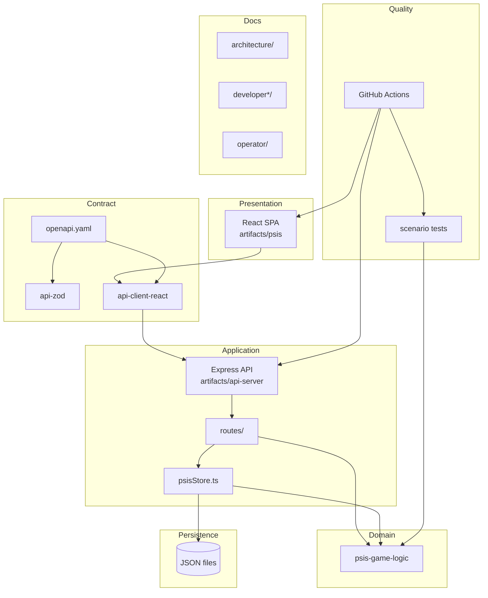
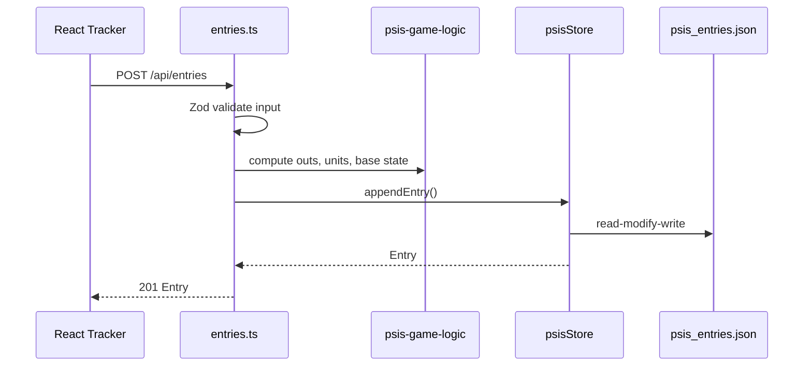

# Logical Architecture

Software structure and component interactions.

---

## Logical View

---

## Major Components

| Component | Package / Path | Responsibility |
|-----------|----------------|----------------|
| **Frontend SPA** | `artifacts/psis` | UX: wizard, scoreboard, dashboard |
| **API Server** | `artifacts/api-server` | HTTP, validation glue, static serve (prod) |
| **Game Logic** | `lib/psis-game-logic` | Pure EABR rules |
| **API Contract** | `lib/api-spec` | OpenAPI + codegen |
| **Persistence adapter** | `psisStore.ts` | JSON read/write |
| **Scenario tests** | `scripts/` | Regression gate |
| **Documentation** | `docs/` | Audience-specific knowledge |

---

## Frontend (Logical)

- **Technology:** React 19, Vite 7, wouter, TanStack Query
- **Communication:** Relative `/api/*` paths via generated hooks
- **State:** Server state via React Query; local wizard state in components
- **No domain math** in presentation layer

---

## Backend (Logical)

- **Technology:** Express 5, pino, Zod
- **Route modules:** health, entries, dashboard, innings, games, sessions
- **Production:** Serves Vite build from `artifacts/psis/dist/public`
- **Development (Replit):** API-only artifact; platform routes to frontend

---

## Shared Libraries (Logical)

| Library | Consumers |
|---------|-----------|
| `api-zod` | API routes |
| `api-client-react` | Frontend |
| `psis-game-logic` | API, scenario tests |
| `db` | Unused scaffold |

---

## Persistence (Logical)

Three JSON documents model:

- Entries (append-only at-bats)
- Game state (current `gameId`)
- Sessions (ended session summaries)

No ORM at runtime. See [Data_Architecture.md](./Data_Architecture.md).

---

## Testing (Logical)

Scenario tests exercise `psis-game-logic` in isolation — no HTTP, no filesystem. This architectural choice decouples **rule correctness** from **infrastructure**.

CI adds integration smoke tests via Docker container HTTP checks.

---

## Documentation (Logical)

Partitioned by cognitive role:

| Partition | Consumers |
|-----------|-----------|
| `architecture/` | Architects |
| `developer*` | Engineers |
| `operator/` | IT |
| `manager/` | Business |

---

## Interaction: Create Entry

---

## Replit vs Docker (Logical Split)

| Mode | Frontend | API | Routing |
|------|----------|-----|---------|
| Replit dev | Separate Vite artifact | Separate Express artifact | Platform |
| Docker prod | Static files | Express + static middleware | Single process |

Logical components unchanged; **deployment binding** differs.

---

## Related

- [Application_Architecture.md](./Application_Architecture.md)
- [Physical_Architecture.md](./Physical_Architecture.md)
