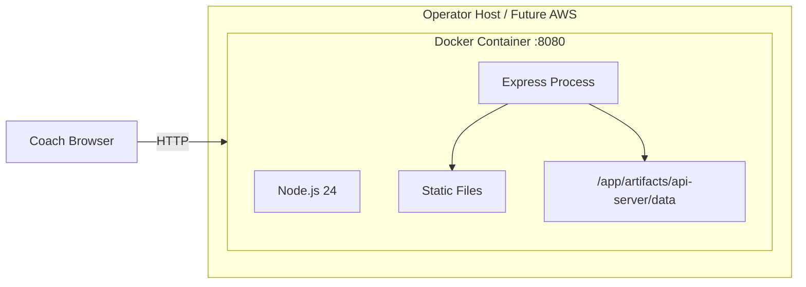
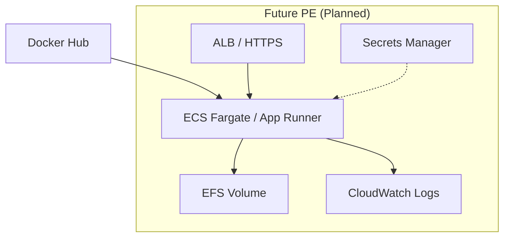

# Physical Architecture

Repository, runtime, registries, and infrastructure mapping.

---

## Repository Physical Layout

```
psis_via_replit/                 Git monorepo (pnpm workspace)
├── artifacts/
│   ├── psis/                    Built → dist/public (static assets)
│   └── api-server/              Built → dist/index.mjs (Node bundle)
├── lib/                         Compiled TypeScript libraries
├── scripts/                     Scenario test runner (Node)
├── docs/                        Markdown documentation (multiple audiences)
├── .github/workflows/           CI/CD YAML
├── Dockerfile                   Image build recipe
└── pnpm-lock.yaml               Locked dependency graph
```

---

## Runtime Physical View (Production)



**Single process** serves API and static frontend. No sidecar in current PA.

---

## Docker Image Physical Contents

| Path in image | Origin |
|---------------|--------|
| `artifacts/api-server/dist/` | esbuild bundle |
| `artifacts/api-server/data/` | Seed JSON |
| `artifacts/psis/dist/` | Vite production build |

No `node_modules` in final layer — API pre-bundled.

---

## GitHub (Physical)

| Asset | Location |
|-------|----------|
| Source | `the-ai-guy-2k/psis_via_replit` |
| CI workflow | `.github/workflows/psis-pa-validation.yml` |
| Secrets | `DOCKERHUB_USERNAME`, `DOCKERHUB_TOKEN` |
| Runner | `ubuntu-latest` (ephemeral) |

---

## Docker Hub (Physical)

| Asset | Value |
|-------|-------|
| Repository | `taig2k/pitching_sequence_intellegence_system_psis` |
| Tags | `latest`, `<commit-sha>` |
| Digest (validated) | `sha256:6049370cb7821985e140985aafbb1097bf8e8e5f2700ce3770d40a6e5504c217` |
| Architecture | `linux/amd64` |

---

## Future AWS Components (Planned)



Not implemented — architectural placeholder for PE ACI.

---

## Network Physical Topology (Current)

```
Coach PC ──HTTP:8080──► Docker host ──► Container
                              ▲
IT operator ──docker pull─────┘
Developer ──git push──► GitHub ──push──► Docker Hub
```

No load balancer, no TLS in current single-host deployment.

---

## Build Physical Pipeline

| Stage | Where it runs |
|-------|---------------|
| `pnpm install` | GitHub Actions runner |
| `test:psis` | GHA + inside `docker build` |
| `pnpm build` | GHA + inside `docker build` |
| `docker build` | GHA runner |
| `docker push` | GHA → Docker Hub |
| `docker pull` | Operator host or future AWS |

---

## Physical Constraints

| Constraint | Impact |
|------------|--------|
| Single-threaded Node event loop | Adequate for single-team use |
| JSON file I/O on local disk | Latency low until file size grows |
| linux/amd64 image only | ARM hosts require emulation or multi-arch future work |
| Replit workspace overrides | Windows dev cannot native-full-build |

---

## Related

- [Deployment_Architecture.md](./Deployment_Architecture.md)
- [Docker Architecture (developer)](../developer/Docker_Architecture.md)
