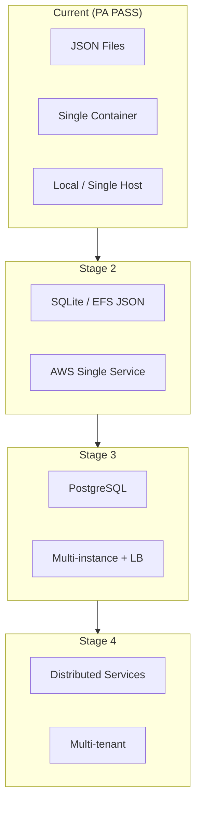

# Scalability Roadmap

Staged evolution from current architecture to enterprise scale.

---

## Overview

PSIS is architected for **incremental scaling** — each stage preserves the Production Artifact and domain library while swapping infrastructure concerns.



---

## Dimension 1: Persistence

| Stage | Technology | Trigger |
|-------|------------|---------|
| **1 (now)** | JSON files | Single team, low concurrency — **current** |
| **2** | JSON on EFS or SQLite | AWS PE, need durable shared storage |
| **3** | PostgreSQL + Drizzle | Concurrent coaches, reporting, analytics |
| **4** | Sharded / read replicas | Multi-org, high volume |

**Invariant:** `psis-game-logic` unchanged across persistence migrations.

---

## Dimension 2: Users

| Stage | Model | Trigger |
|-------|-------|---------|
| **1 (now)** | Open URL, no auth | Trusted network — **current** |
| **2** | Network restriction + VPN | Broader access |
| **3** | App-level auth (JWT/OAuth) | Untrusted networks |
| **4** | RBAC, multi-tenant isolation | Enterprise |

---

## Dimension 3: Deployment Topology

| Stage | Topology | Trigger |
|-------|----------|---------|
| **1 (now)** | Docker on single host | PA — **current** |
| **2** | AWS ECS/App Runner (1 task) | PE ACI |
| **3** | ALB + multiple tasks | Uptime / load |
| **4** | Multi-region | SLA requirements |

---

## Dimension 4: Application Structure

| Stage | Structure | Trigger |
|-------|-----------|---------|
| **1 (now)** | Monolith container | Simplicity — **current** |
| **2** | Monolith + CDN for static | Global latency |
| **3** | Split API and SPA | Independent scale |
| **4** | Microservices by domain | Team size / boundaries |

---

## Scaling Metrics to Watch

| Metric | Threshold signal |
|--------|------------------|
| `psis_entries.json` size | >10MB — slow reads |
| Concurrent writers | >1 process — corruption risk |
| API p95 latency | Sustained >500ms |
| Coach count | >10 simultaneous |
| Session query complexity | Dashboard timeouts |

---

## Recommended Evolution Sequence (Nebula)

```
1. PA PASS                    ✓ Complete
2. AWS PE (single task + EFS) → Next
3. Auth + TLS (ALB/ACM)
4. PostgreSQL migration ACI
5. Multi-tenant / analytics   → Future_Architecture.md
```

---

## What Not to Scale Prematurely

| Premature scale | Wait for |
|-----------------|----------|
| Kubernetes | Proven multi-service need |
| Microservices | Team/org pain with monolith |
| Read replicas | PostgreSQL first |
| Caching layer | Measured read bottleneck |

---

## Backward Compatibility During Scale

- OpenAPI versioning if breaking API changes
- Dual-write period during DB migration
- Image tags per release — never force operators to `latest` only

---

## Related

- [Data_Architecture.md](./Data_Architecture.md)
- [Future_Architecture.md](./Future_Architecture.md)
