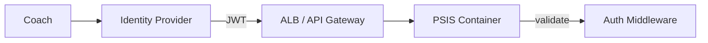

# Security Architecture

Current posture, limitations, and future controls.

---

## Security Posture Summary

| Area | Current state |
|------|---------------|
| **Authentication** | None |
| **Authorization** | None |
| **Transport** | HTTP (no TLS in container) |
| **Data at rest** | Unencrypted JSON files |
| **Secrets in app** | None required for runtime |
| **CI secrets** | Docker Hub credentials in GitHub Secrets |
| **Supply chain** | pnpm lockfile, `minimumReleaseAge`, frozen CI install |

**Classification:** Trusted-network coaching tool — **not** internet-hardened multi-tenant SaaS.

---

## Threat Model (Simplified)

| Threat | Current exposure | Mitigation today |
|--------|------------------|------------------|
| Unauthorized user accesses PSIS | High if URL reachable | Network isolation |
| Data loss | Medium | Operator backup |
| Image tampering | Low | Docker Hub + digest verification |
| Dependency vulnerability | Medium | Lockfile, release age guard |
| Stolen GitHub secrets | Medium | GitHub secret scope, rotation |
| MITM on HTTP | High on public network | Not mitigated — use private network |

---

## Application Security

| Control | Status |
|---------|--------|
| Input validation (Zod) | Active on API |
| Server-side scoring | Client cannot forge units |
| CORS | Permissive (`cors()` default) — acceptable on trusted network only |
| Rate limiting | Not implemented |
| CSRF | Low risk for JSON API; no cookies for auth |
| XSS | React default escaping; avoid `dangerouslySetInnerHTML` |

---

## Container Security

| Topic | Current | Recommended (PE) |
|-------|---------|------------------|
| Run as root | Yes (node image default) | Non-root USER |
| Read-only rootfs | No | Consider with tmpfs |
| HEALTHCHECK | Not in Dockerfile | Add |
| Image scanning | Docker Hub / manual | CI scan step |
| Resource limits | Operator-defined | ECS task limits |

---

## GitHub Actions Security

| Control | Implementation |
|---------|----------------|
| Secrets | `DOCKERHUB_USERNAME`, `DOCKERHUB_TOKEN` |
| Fork PRs | Verify secret exposure policy on repo |
| Workflow permissions | Default — review for least privilege |
| Branch protection | Recommended on `main` |

---

## Secrets Management

| Secret | Location | Consumers |
|--------|----------|-----------|
| Docker Hub creds | GitHub Encrypted Secrets | CI publish step |
| Runtime secrets | None today | — |
| Future DB password | AWS Secrets Manager (planned) | ECS task |

**Never** commit `.env` with credentials.

---

## Future Authentication Architecture (Planned)

Options to evaluate in future ACI:

- OAuth2/OIDC (Google, Microsoft)
- JWT bearer tokens
- Session cookies with server-side store

Requires OpenAPI `securitySchemes` + `app.ts` middleware — **architectural change**.

---

## Future Cloud Security (PE)

| Control | AWS service |
|---------|-------------|
| TLS | ACM + ALB |
| Network isolation | VPC, security groups |
| Secrets | Secrets Manager |
| Logs | CloudWatch (no PII in logs by design) |
| Backup encryption | EFS encryption at rest |
| IAM | Task role least privilege |

---

## Data Privacy

- Coaching data stored locally/operator-controlled
- No third-party analytics in current release
- Log redaction for Authorization and cookies (pino)

---

## Security Review Triggers

Update this document when:

- PSIS exposed to public internet
- Authentication added
- AWS PE deployed
- Compliance requirements emerge (e.g., youth data policies)

---

## Related

- [Decision_Record.md](./Decision_Record.md) — ADR-008
- [Future_Architecture.md](./Future_Architecture.md)
- [Operator docs](../operator/PSIS_Operator_Installation_Guide.md) — network placement
