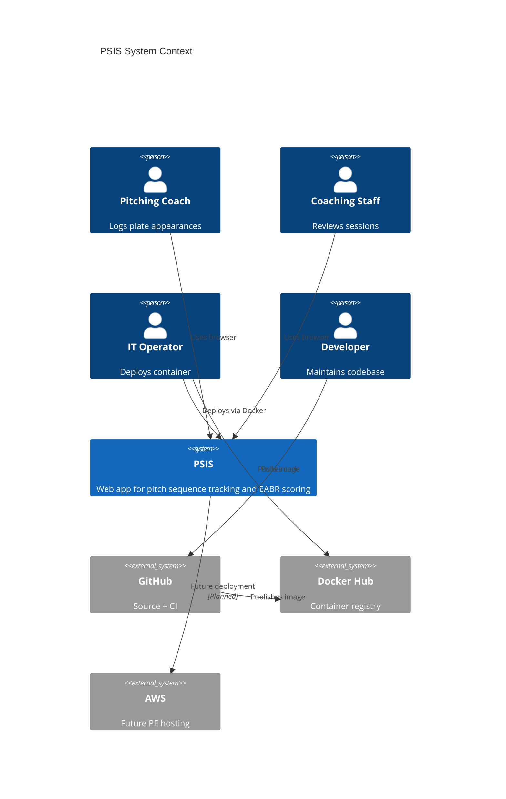

# System Context

Problem domain, actors, and system boundaries.

---

## Problem Domain

Baseball pitching coaches need to log pitch sequences and plate-appearance outcomes, apply a consistent EABR (End of At-Bat Result) scoring framework, and review session-level performance over time — without spreadsheets or inconsistent manual notes.

PSIS is a **single-team coaching tool**, not a league management platform.

---

## Actors

| Actor | Role | Interaction |
|-------|------|-------------|
| **Pitching coach** | Primary user | Logs at-bats via Tracker |
| **Coaching staff** | Secondary user | Reviews Dashboard sessions |
| **IT operator** | Deployer | Pulls Docker image, runs container, backs up data |
| **Team manager** | Oversight | Verifies availability; does not deploy |
| **Developer** | Maintainer | Implements features; merges to `main` |
| **GitHub Actions** | Automated actor | Tests, builds, publishes image |
| **Docker Hub** | Registry | Stores Production Artifact |

---

## External Systems

| System | Relationship | Current |
|--------|--------------|---------|
| **GitHub** | Source control + CI | Active |
| **Docker Hub** | Image registry | Active |
| **AWS** | Production hosting | Planned (PE phase) |
| **Replit** | Original dev platform | Legacy dev path only |
| **Identity provider** | Authentication | Not integrated |
| **External database** | Persistence | Not integrated |

---

## System Context Diagram



---

## High-Level Boundary

**In scope (PSIS system boundary):**

- React SPA (Tracker, Dashboard, Home)
- Express REST API
- EABR game logic library
- JSON persistence
- Production Docker image
- CI/CD pipeline to Docker Hub

**Out of scope (current release):**

- User authentication
- Multi-tenant roster management
- AI recommendations
- Cloud database
- TLS termination inside container
- AWS infrastructure (until PE ACI)

---

## User Journey (Context Level)

```
Coach → Browser → PSIS (UI + API + data)
Operator → Docker Hub → PSIS container on host
Developer → GitHub → CI → Docker Hub
```

---

## Constraints from Origin

PSIS was rebuilt on a **pnpm/TypeScript/Replit** stack from an original Python/Flask + JSON file concept. Architecture preserves the **JSON file storage intent** while using supported web technologies.

See `replit.md` and [Decision_Record.md](./Decision_Record.md).

---

## Related

- [Logical_Architecture.md](./Logical_Architecture.md)
- [Deployment_Architecture.md](./Deployment_Architecture.md)
