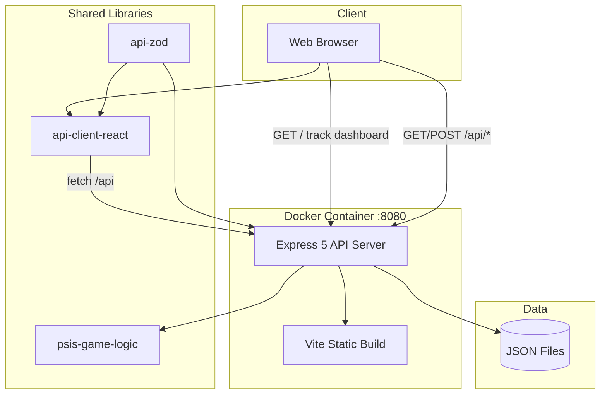

# Architecture Overview

High-level engineering view of PSIS.

---

## System Summary

PSIS is a **single-deployable-unit** application: one Express process serves the REST API and (in production) the compiled React SPA. Business rules live in a shared pure-logic library. Data persists as JSON files on disk.

| Layer | Technology | Package |
|-------|------------|---------|
| Frontend | React 19, Vite 7, wouter, TanStack Query | `@workspace/psis` |
| API | Express 5, pino, Zod validation | `@workspace/api-server` |
| Contract | OpenAPI 3.1 → Orval codegen | `@workspace/api-spec` |
| Game logic | Pure TypeScript (no I/O) | `@workspace/psis-game-logic` |
| Persistence | JSON files | `artifacts/api-server/data/` |
| Package manager | pnpm workspaces | Node.js 24 |

---

## Deployment Models

### Current — Docker Production Artifact

```
GitHub (main push)
    → GitHub Actions (test, build, docker build, smoke test)
    → Docker Hub (taig2k/pitching_sequence_intellegence_system_psis)
    → Operator pulls & runs container
```

Single container exposes port **8080**. Express mounts `/api/*` for the API and serves `artifacts/psis/dist/public` for the SPA.

### Future — AWS PE (Planned)

Not implemented. Anticipated pattern:

```
Docker Hub image
    → ECS Fargate / App Runner / EKS
    → ALB health check on /api/healthz
    → EFS or EBS volume for artifacts/api-server/data
    → Optional CloudFront + ACM for TLS
```

See [Technical_Debt.md](./Technical_Debt.md) for migration considerations.

---

## Component Diagram



---

## React Frontend

- **Location:** `artifacts/psis/`
- **Routing:** wouter (`/`, `/track`, `/dashboard`)
- **Data fetching:** Generated React Query hooks from `@workspace/api-client-react`
- **Forms:** react-hook-form + Zod resolvers
- **Build output:** `artifacts/psis/dist/public/`

In Replit dev, frontend and API run as separate artifacts with platform routing. In Docker production, Express serves both.

---

## Express Backend

- **Location:** `artifacts/api-server/`
- **Entry:** `src/index.ts` (requires `PORT` env)
- **Routes:** `src/routes/` mounted at `/api`
- **I/O:** `src/lib/psisStore.ts` — JSON read/write only
- **Bundle:** esbuild → `dist/index.mjs`

---

## pnpm Workspace

Root `pnpm-workspace.yaml` includes:

- `artifacts/*` — deployable applications
- `lib/*` — shared libraries
- `scripts` — scenario test runner

Workspace packages reference each other via `workspace:*` protocol.

---

## Shared Libraries

| Package | Role |
|---------|------|
| `@workspace/api-spec` | OpenAPI YAML + Orval codegen driver |
| `@workspace/api-zod` | Generated Zod schemas and types |
| `@workspace/api-client-react` | Generated React Query hooks + `custom-fetch` |
| `@workspace/psis-game-logic` | Pure game/EABR/session calculations |
| `@workspace/db` | Drizzle schema (scaffold only — **not used** by PSIS runtime) |

---

## Data Flow — Create Entry

```
1. Coach submits Tracker form
2. React hook POST /api/entries (CreateEntryInput)
3. entries.ts validates input against Zod
4. psisStore resolves inning, outs, base state, EABR units
5. psis-game-logic computes goodCount, badCount, delta, RBI, etc.
6. Entry appended to psis_entries.json
7. 201 Entry returned → React Query invalidates caches
```

---

## JSON Persistence

| File | Purpose |
|------|---------|
| `psis_entries.json` | All plate-appearance entries |
| `psis_game_state.json` | Current `gameId` boundary |
| `psis_sessions.json` | Saved session summaries |

No database. Volume mount at `/app/artifacts/api-server/data` required for Docker persistence.

---

## API Contract Source of Truth

`lib/api-spec/openapi.yaml` drives:

- Server route documentation alignment
- Zod schemas (`@workspace/api-zod`)
- React Query hooks (`@workspace/api-client-react`)

**Never change the OpenAPI `info.title`** — Orval import paths depend on it.

---

## Cross-Cutting Concerns

| Concern | Implementation |
|---------|----------------|
| Validation | Zod (server + client) |
| Logging | pino + pino-http |
| Auth | None |
| HTTPS | External (reverse proxy) |
| Health | `GET /api/healthz` |
| Tests | Scenario script (`pnpm run test:psis`) |
