# CI/CD Pipeline

GitHub Actions workflow for PSIS Production Artifact validation and publication.

---

## Workflow File

`.github/workflows/psis-pa-validation.yml`

| Property | Value |
|----------|-------|
| Name | PSIS PA Validation |
| Triggers | `push` → `main`, `workflow_dispatch` |
| Runner | `ubuntu-latest` |
| Image | `taig2k/pitching_sequence_intellegence_system_psis` |

---

## Pipeline Stages

```mermaid
flowchart LR
    A[Checkout] --> B[pnpm install]
    B --> C[test:psis]
    C --> D[pnpm build]
    D --> E[docker build]
    E --> F[Smoke test local image]
    F --> G[Docker Hub login]
    G --> H[Push latest + SHA]
    H --> I[Verify tags]
    I --> J[Pull from Hub]
    J --> K[Smoke test published image]
    K --> L[Generate PA report]
    L --> M[Upload artifact]
```



---

## Validation Gates

| Stage | Fail behavior |
|-------|---------------|
| `pnpm install --frozen-lockfile` | Workflow stops |
| `pnpm run test:psis` | Workflow stops |
| `pnpm run build` | Workflow stops |
| `docker build` | Workflow stops (tests also run inside Dockerfile) |
| Local container smoke test | Workflow stops |
| Docker Hub publish | Workflow stops |
| Published image smoke test | Workflow stops |

No stage is allowed to fail silently.

---

## Toolchain

```yaml
- pnpm/action-setup@v4    # reads packageManager from package.json
- actions/setup-node@v4   # Node 24, pnpm cache
- pnpm config set minimum-release-age 0   # CI override for workspace guard
```

---

## Smoke Tests

Run against container on host port `18080` / `18081`:

| Endpoint | Pass criteria |
|----------|---------------|
| `GET /api/healthz` | HTTP 200, `"status":"ok"` |
| `GET /` | HTTP 200, contains `id="root"` |
| `GET /track` | HTTP 200, SPA fallback |

Performed twice:

1. On locally built `ci-${{ github.sha }}` image
2. On `latest` pulled from Docker Hub after publish

---

## Docker Hub Publish

```bash
docker tag ... :latest
docker tag ... :${{ github.sha }}
docker push ... :latest
docker push ... :${{ github.sha }}
```

Tag digest equality verified via `docker buildx imagetools inspect`.

**Secrets (Nebula standard):**

- `DOCKERHUB_USERNAME`
- `DOCKERHUB_TOKEN`

---

## Artifact Generation

| Artifact name | File | Retention |
|---------------|------|-----------|
| `PSIS_PA_Validation` | `docs/reports/PSIS_PA_Validation_Report.md` | 30 days |

Generated at end of successful run with commit SHA, digest, and smoke test results.

---

## Current Governance

| Rule | Detail |
|------|--------|
| Docker activities | GitHub Actions only (not local operator laptops) |
| Test gate | `test:psis` required before build and inside Dockerfile |
| Publish | Automatic on `main` push success |
| Image tags | `latest` + commit SHA |
| AWS deploy | Not in this workflow — future ACI |
| Branch policy | `main` is release branch |

---

## Known CI Fixes (Historical)

| Issue | Resolution |
|-------|------------|
| `minimumReleaseAge` blocked install | `pnpm config set minimum-release-age 0` |
| Duplicate pnpm version spec | Use `packageManager` field only |
| `GET /` smoke test 404 | Express static `index: "index.html"` for root |

---

## Reproducing Locally

Use Linux or WSL:

```bash
pnpm install --frozen-lockfile
PORT=8080 BASE_PATH=/ NODE_ENV=production pnpm run test:psis
pnpm run build
docker build -t psis:local .
```

Windows native `pnpm run build` may fail — see [Technical_Debt.md](./Technical_Debt.md).

---

## Related

- [Build_and_Deployment.md](./Build_and_Deployment.md)
- [Docker_Architecture.md](./Docker_Architecture.md)
- `docs/reports/` — ACI validation reports
